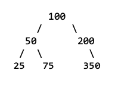

# Breadth-First Search (BFS) and Depth-First Search (DFS) in Trees

> Simple explanation of Breadth-First Search (BFS) and Depth-First Search (DFS) algorithms as they apply to tree data structures.

  

## Breadth-First Search (BFS)

BFS is a graph traversal algorithm that explores all the neighbor nodes at the present depth prior to moving on to the nodes at the next depth level. It uses a queue data structure to keep track of the nodes to be visited.

**How BFS Works:**

1.  Start at the root node.
2.  Enqueue the root node.
3.  While the queue is not empty:
    * Dequeue a node.
    * Visit the node.
    * Enqueue all the node's children.

**Example (using the tree in the image):**

BFS traversal: `100, 50, 200, 25, 75, 350`

## Depth-First Search (DFS)

DFS is a graph traversal algorithm that explores as far as possible along each branch before backtracking. It uses a stack (or recursion, which uses the call stack) to keep track of the nodes to be visited.

**Common Types of DFS:**

* **Preorder DFS:**
    * Visit the current node.
    * Traverse the left subtree.
    * Traverse the right subtree.
    * Example: `100, 50, 25, 75, 200, 350`
* **Inorder DFS:**
    * Traverse the left subtree.
    * Visit the current node.
    * Traverse the right subtree.
    * Example: `25, 50, 75, 100, 200, 350` (Especially useful for Binary Search Trees as it gives the nodes in sorted order)
* **Postorder DFS:**
    * Traverse the left subtree.
    * Traverse the right subtree.
    * Visit the current node.
    * Example: `25, 75, 50, 350, 200, 100`

**Example (Preorder DFS using the tree in the image):**

DFS traversal: `100, 50, 25, 75, 200, 350`

## Comparison of BFS and DFS

| Feature        | BFS                                 | DFS                               |
| :------------- | :---------------------------------- | :-------------------------------- |
| Data Structure | Queue                               | Stack (or recursion)              |
| Traversal      | Level-by-level                      | Depth-first (branch-by-branch)    |
| Space Complexity | Higher (stores all nodes at a level) | Lower (stores only nodes on a path) |
| Finding Shortest Path | Guaranteed to find the shortest path in an unweighted graph | Not guaranteed to find the shortest path |
| Implementation | Iterative                           | Recursive or iterative          |

**Which is Better?**

* **BFS:**
    * Useful for finding the shortest path in unweighted graphs.
    * Good for exploring all nodes at a given level.
    * Pitfalls: Can use a lot of memory if the tree is very wide.
* **DFS:**
    * Useful for exploring all paths in a tree or graph.
    * Good for checking if a path exists.
    * Good for tasks like topological sorting.
    * Pitfalls: Can get stuck in infinite loops if not implemented carefully (especially in graphs with cycles). Can use a lot of stack space (or cause stack overflow) in very deep trees. Does not guarantee shortest paths.

**Pitfalls of Each:**

* **BFS:**
    * Memory usage can be high, especially for wide trees, as it stores nodes at each level.
* **DFS:**
    * Can lead to stack overflow in very deep trees due to recursive calls.
    * In graphs with cycles, DFS can get stuck in infinite loops if not implemented with a "visited" set to avoid revisiting nodes.
    * If not careful, DFS will not always find the shortest path, where BFS is guaranteed to.

**Choosing the Right Algorithm:**

* Use BFS when you need to find the shortest path or explore nodes level by level.
* Use DFS when you need to explore all paths or check for the existence of a path, or when memory usage is a primary concern.

## Real-World Applications of Trees

Trees are fundamental data structures with numerous real-world applications:

* **File Systems:**
    * Operating systems use tree structures to organize files and directories. Directories are nodes, and files or subdirectories are their children.
* **Databases:**
    * Indexing in databases (e.g., B-trees) uses tree structures to efficiently search and retrieve data.
* **Domain Name System (DNS):**
    * The DNS uses a hierarchical tree structure to map domain names to IP addresses.
* **HTML/XML Parsing:**
    * Web browsers and XML parsers use tree structures (DOM) to represent the structure of HTML and XML documents.
* **Decision Trees:**
    * Machine learning algorithms use decision trees for classification and regression tasks.
* **Organizational Charts:**
    * Companies use organizational charts to represent hierarchical relationships between employees.
* **Syntax Trees:**
    * Compilers use syntax trees to represent the structure of programming code.
* **Game AI:**
    * Game AI uses trees (e.g., Minimax trees) to make decisions in games.
* **Social Networks:**
    * Social networks can represent user relationships using tree-like structures (though often graphs are more appropriate).
* **Routing Algorithms:**
    * Network routing algorithms can use tree structures to find the most efficient route between two points.

These are just a few examples of how trees are used in various domains. Their hierarchical nature and efficient traversal algorithms make them valuable tools in computer science and beyond.